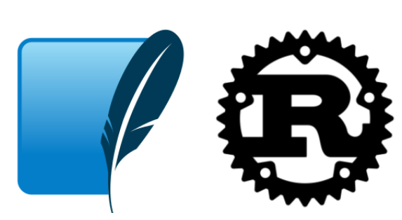

[](https://github.com/nogibjj/Eric_Ortega_Rodriguez_Individual_Project_2/actions/workflows/cicd.yml)

# Individual Project #2: Rust CLI Binary with SQLite

**Eric Ortega Rodriguez**

---

<div style="text-align: center;">
    
</div>

---

## Project Overview

This project is a Rust-based command-line interface (CLI) application that uses an SQLite database to demonstrate CRUD operations. The application is optimized for performance and includes a GitHub Actions CI/CD workflow for continuous integration and deployment. The project showcases Rust’s syntax and features, Copilot assistance, and automated CI/CD for robust development.

### Project Structure

- **Rust Source Code**: Implements Rust’s syntax features, including `Result` and `Option` for error handling, memory safety, and type inference.
- **SQLite Database**: Integrates SQLite for local storage, providing CRUD (Create, Read, Update, Delete) operations on records.
- **Optimized Rust Binary**: Compiled as an optimized binary using GitHub Actions, available for download as a release artifact.
- **GitHub Copilot & LLM**: Assisted with code suggestions and optimizations, increasing productivity and efficiency.
- **GitHub Actions**: Automated CI/CD pipeline for testing, building, and linting the code.

## Features

- **CRUD Operations**: Supports create, read, update, and delete operations within an SQLite database.
- **High Performance**: Optimized Rust binary for efficient execution and low memory usage.
- **Automated CI/CD**: CI/CD pipeline for continuous integration, testing, building, and linting.

## Getting Started

### Prerequisites

- **Rust**: Install Rust from [rust-lang.org](https://www.rust-lang.org/).
- **SQLite**: Ensure SQLite is installed on your system.

### Installation

1. Clone this repository:
    ```bash
    git clone https://github.com/nogibjj/Eric_Ortega_Rodriguez_Individual_Project_2
    cd Eric_Ortega_Rodriguez_Individual_Project_2
    ```

2. Build the Rust binary:
    ```bash
    cargo build --release
    ```

3. Run the CLI application:
    ```bash
    ./target/release/rust_cli_binary
    ```

### Usage

The CLI provides several commands to interact with the SQLite database. Here are some examples:

- **Create a Record**:
    ```bash
    ./target/release/rust_cli_binary create <data>
    ```

- **Read Records**:
    ```bash
    ./target/release/rust_cli_binary read
    ```

- **Update a Record**:
    ```bash
    ./target/release/rust_cli_binary update <id> <new-data>
    ```

- **Delete a Record**:
    ```bash
    ./target/release/rust_cli_binary delete <id>
    ```

Replace `<binary-name>` with the actual name of your binary if it differs.

## LLM Assistance

Throughout the development process, large language models (LLMs) were used to:

- Optimize Rust syntax
- Implement efficient error handling
- Provide code suggestions for Rust best practices and memory management
- Generate boilerplate code for SQLite connection and CRUD operations

## Optimized Binary Artifact

This project includes a GitHub Actions workflow that builds an optimized binary, downloadable as an artifact. You can download the latest optimized binary from [this link](https://github.com/nogibjj/Eric_Ortega_Rodriguez_Individual_Project_2/actions/runs/11674989311/artifacts/2144072759).

## Video Demo

A video demonstration showcasing the Rust CLI application, its features, and a step-by-step usage guide can be found [here](https://youtu.be/OCWev0BkCQQ). 
